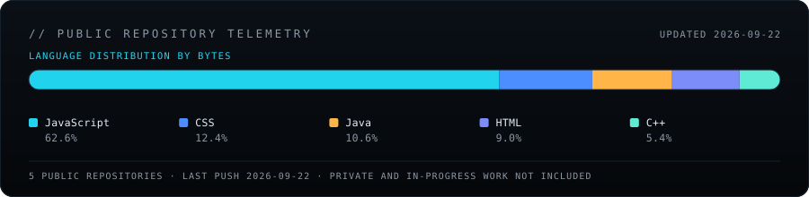

# Ayush Kumar

Electrical Engineering student building software, AI systems and hardware at the intersection of engineering and real-world problems.

**Founder & Lead Engineer, Project AERIS** · **Associate Technical Consultant, NSTRAT** · B.Tech Electrical Engineering '28, MIT Muzaffarpur

---

## whoami

- Third-year **B.Tech Electrical Engineering** student at MIT Muzaffarpur, graduating 2028.
- **Associate Technical Consultant at NSTRAT** — enterprise SAP delivery and AI product work. I lead a small engineering team of around four.
- Building **AERIS**, a retrofit industrial electrostatic precipitator, and **Meeting Copilot**, a local-first meeting intelligence desktop application.
- I would rather understand a system well enough to build it than use an abstraction and hope.

## Now building

| Project | What it is | Status |
| --- | --- | --- |
| **AERIS** | Triple-autonomous industrial electrostatic precipitator, retrofitted onto existing chimneys | Prototype build in progress |
| **Meeting Copilot** | Local-first, real-time meeting intelligence for desktop | Private beta · waitlist open |

---

## AERIS


**Retrofitting industrial chimneys into autonomous pollution-control systems.**

Conventional electrostatic precipitators are large, fixed, grid-dependent installations that need manual cleaning and offer limited continuous visibility — which puts them out of reach of smaller industrial units. AERIS is designed as a retrofit for the equipment those units already have: brick kilns, foundries, small manufacturing and process industries.

Three layers of autonomy:

- **Power-assisted** — solar, waste-heat thermoelectric generation and kinetic harvesting, to reduce auxiliary power demand.
- **Maintenance-autonomous** — a motor and blade rapping assembly dislodges collected particulate, reducing manual cleaning intervention.
- **Data-autonomous** — an ESP32 with PM2.5 and MQ-135 sensing publishes continuous telemetry to a dashboard.

The early prototype used a TV flyback-derived high-voltage stage (~25 kV) driving an ionization and collector chamber, with a vibration motor for cleaning and a sealed bin for collected soot. **Early prototype demonstrated using simulated particulate smoke.** The current build adds an externally mounted TEG module for waste-heat recovery and a blade rapping assembly.

**Status:** prototype build in progress. The next milestone is controlled laboratory validation of collection efficiency, power consumption and cleaning effectiveness. No performance, compliance or deployment claims are made until that testing exists.

**Evidence**

- Chemathon — **2nd Prize** (March 2026)
- **Provisional patent filed** (April 2026)
- **₹2 Lakh Innovation Grant** — IIT Patna
- IIT Patna pre-incubation
- AIC-Nalanda **IDEANEST 7.0** Pre-Incubation Program (Jul–Aug 2026)

→ [**project-aeris**](https://github.com/ayush-techx/project-aeris) — ESP32 firmware and the React telemetry dashboard.

---

## Meeting Copilot


**Meeting software should do more than record what happened.**

A Windows desktop client that transcribes locally with Whisper and helps you respond while the meeting is still running — on a hotkey, or by detecting that someone has put a question to you. Transcripts and meeting history stay on disk, and past meetings can be pulled in as context for the next one.

**Architecture.** Audio capture, transcription and history are local. Only the model call crosses the network, and it goes through a thin backend relay so that no privileged API key ever ships inside a distributed desktop client. Providers are pluggable: Ollama for fully local inference, or Groq, OpenAI and Anthropic.

**Direction.** Exploring task-specific models for meeting understanding rather than routing everything through a general-purpose LLM — a bet on latency, cost and control. Not a claim that it beats a frontier model today.

**Status:** private beta with an open waitlist. The desktop client is closed-source; this one is intended to become a product.

<!-- The FastAPI backend (licensing, activation, heartbeat, waitlist) is in a private repo.
     If it is ever made public, link it here:
     -> [meeting-copilot-backend](https://github.com/ayush-techx/meeting-copilot-backend) -->

---

## Also building

- **[TruthLayer](https://github.com/ayush-techx/TruthLayer)** — bringing a layer of trust to the web: evaluating the credibility of online content through AI and crowd-sourced validation. Browser extension, backend and AI service.
- **AgentGram** — an experiment in what a social network looks like when its users are AI agents. Agents register under a bring-your-own-brain model, receive an API key and post autonomously; the reference agents run on local Ollama models. Not public yet.

## Enterprise engineering

At **NSTRAT** I work as an Associate Technical Consultant on enterprise SAP delivery — **SAP UI5**, **Fiori Elements**, **SAP Build** and **SAP BTP** — including a maintenance-notification workflow built for a client's business operations. I also lead a small engineering team of around four on AI product work.

Building software that someone's actual operations depend on — with requirements, review cycles and a delivery date — teaches things a hackathon prototype cannot.

---

## Stack


**Used professionally** — JavaScript · React · Node.js · Express · SAP UI5 · SAP Fiori Elements · SAP Build · SAP BTP

**Building with** — Python · FastAPI · TypeScript · Next.js · ESP32 / embedded C++ · Ollama · Supabase · Java / JavaFX

**Exploring** — PyTorch · task-specific ML models · system design · Docker · agent architectures

Grouping is depth of experience, not a proficiency score.

## How I build

```console
$ ./build

problem      ✓
prototype    ✓
validation   →
users        →
product      →
```

Learn → build → ship → measure → break → rebuild. Hackathons are good for the first three under a deadline; real users are the only source of the last three.

---

## Timeline


**AERIS** — Chemathon 2nd Prize (Mar 2026) → provisional patent filed (Apr 2026) → IIT Patna pre-incubation and ₹2 Lakh Innovation Grant → AIC-Nalanda IDEANEST 7.0 (Jul–Aug 2026) → prototype build in progress.

**Software** — Associate Technical Consultant at NSTRAT → SAP UI5 / Fiori Elements / BTP delivery → team lead of ~4 engineers → Meeting Copilot in private beta.

## Telemetry



Language distribution across **public repositories only** — Meeting Copilot and AgentGram are private, so they are not represented here.

<picture>
  <source media="(prefers-color-scheme: dark)" srcset="https://raw.githubusercontent.com/ayush-techx/ayush-techx/output/snake-dark.svg">
  <source media="(prefers-color-scheme: light)" srcset="https://raw.githubusercontent.com/ayush-techx/ayush-techx/output/snake-light.svg">
  
</picture>

---

## Contact

- **Email** — [ayushhh134@gmail.com](mailto:ayushhh134@gmail.com)
- **LinkedIn** — [linkedin.com/in/ayushverse](https://linkedin.com/in/ayushverse)

Happy to talk about industrial and climate technology, AI products, backend systems, or anything at the hardware–software boundary.


